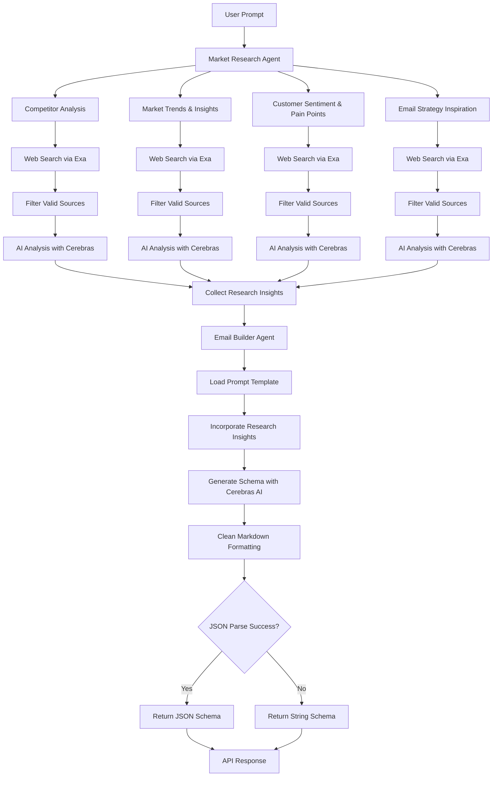

# Email Builder Agent Architecture

## Overview

The Email Builder Agent is an AI-powered system that generates professional email templates based on market research and user prompts. It combines web research capabilities with AI content generation to create structured email schemas.

## Workflow Architecture



## Detailed Workflow

### 1. User Input

- User provides a prompt describing the email campaign (e.g., "promote our new saas AI image tool")

### 2. Market Research Agent

The agent performs comprehensive market research through four parallel subtasks:

#### Competitor Analysis

- Searches for competitors, their email campaigns, tone, offers, and frequency
- Identifies market positioning and competitive gaps

#### Market Trends & Insights

- Researches latest trends in the topic area
- Monitors social media, news, and Google Trends data

#### Customer Sentiment & Pain Points

- Analyzes customer reviews and feedback
- Gathers insights from forums, Reddit, Quora, and Twitter

#### Email Strategy Inspiration

- Studies effective email marketing strategies
- Analyzes subject lines, hooks, open rates, and click rates

Each subtask:

1. Performs web search using Exa API (up to 3 results)
2. Filters results to ensure content quality (>200 characters)
3. Uses Cerebras AI to summarize key insights into 2-3 bullet points

### 3. Email Builder Agent

Takes the user prompt and research insights to generate the email schema:

1. **Load Template**: Reads the structured prompt from `prompt_email.txt`
2. **Incorporate Research**: Appends market research insights to the prompt
3. **AI Generation**: Uses Cerebras AI to generate email schema in JSON format
4. **Response Processing**:
   - Strips markdown code block formatting (`json ... `)
   - Attempts JSON parsing
   - Returns parsed JSON object or raw string if parsing fails

### 4. Output

Returns a structured email schema containing:

- Logo headers
- Text content with emojis
- Images and buttons
- Multi-column layouts
- Styling information

## Technical Components

- **Web Research**: Exa API for comprehensive web searching
- **AI Processing**: Cerebras LLM for both research analysis and content generation
- **Response Format**: JSON schema following predefined structure with components like LogoHeader, Text, Image, Button, etc.
- **Error Handling**: Graceful fallback to string response if JSON parsing fails

## API Endpoint

```
POST /generate-email-schema
{
  "prompt": "your email campaign description"
}
```

Response:

```json
{
  "schema": [
    {
      "0": {
        "type": "LogoHeader",
        "imageUrl": "/logo.svg"
        // ... component properties
      },
      "label": "Column",
      "type": "column",
      "numOfCol": 1
      // ... column properties
    }
    // ... more columns
  ]
}
```
