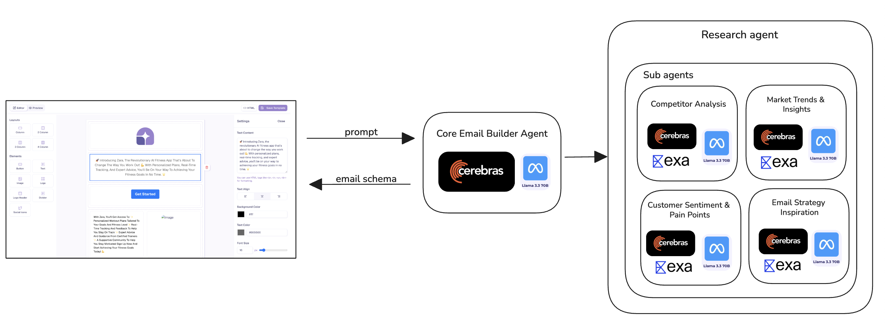

# AI Agents for Customer Support and Email Building

## Techstack


## Customer Support Agent

We built the customer_support_agent using the CrewAI framework with Cerebras inference (Llama 3.3-70B) for super fast responses, which is critical in the customer support industry. The agent integrates Retrieval-Augmented Generation (RAG) for querying the knowledge base, Stripe MCP for managing payments and subscriptions, and Slack tools for team communication and notifications. It dynamically configures tools per request based on enabled capabilities.


### Overview

The Customer Support Agent is an AI-powered assistant that handles customer inquiries using a combination of knowledge base retrieval, payment management, and team communication tools. It provides fast, accurate responses while performing necessary actions like processing refunds or notifying the team.

### Workflow

1. **User Input**: Receives customer message along with agent ID and enabled capabilities (Stripe, Slack, Calendar).

2. **Dynamic Configuration**: Fetches credentials from Doppler and configures available tools (RAG, Stripe MCP, Slack tools).

3. **Agent Execution**: Uses CrewAI to create and run the support agent, which can query knowledge base, manage subscriptions, communicate via Slack, etc.

4. **Response Generation**: Produces a well-structured, polite response to the customer.

### API Endpoints

#### Chat Endpoint

```
POST /chat
{
  "message": "customer inquiry",
  "agentId": "agent-id",
  "StripeEnabled": true,
  "SlackEnabled": false,
  "CalEnabled": false,
  "CalUrl": "optional calendar url"
}
```

Response:

```json
{
  "response": "AI-generated customer response"
}
```

#### Process File Endpoint

```
POST /process-file
{
  "url": "file-url",
  "filename": "file.pdf",
  "agentId": "agent-id"
}
```

Response:

```json
{
  "success": true,
  "message": "File processed successfully",
  "chunks_processed": 10
}
```

## Email Builder Agent

We built the email_builder_agent using Cerebras for AI processing, Llama LLM for language understanding, and Exa for web research to gather market insights.



### Overview

The Email Builder Agent is an AI-powered system that generates professional email templates based on market research and user prompts. It combines web research capabilities with AI content generation to create structured email schemas.

### Workflow

1. **User Input**: User provides a prompt describing the email campaign.

2. **Market Research**: Performs comprehensive research using Exa API for web searching and Cerebras AI for analysis.

3. **Email Generation**: Uses Cerebras AI to generate email schema in JSON format based on research insights.

4. **Output**: Returns structured email schema with components like LogoHeader, Text, Image, Button, etc.

### API Endpoint

```
POST /generate-email-schema
{
  "prompt": "your email campaign description"
}
```

Response:

```json
{
  "schema": [
    {
      "0": {
        "type": "LogoHeader",
        "imageUrl": "/logo.svg"
        // ... component properties
      },
      "label": "Column",
      "type": "column",
      "numOfCol": 1
      // ... column properties
    }
    // ... more columns
  ]
}
```
